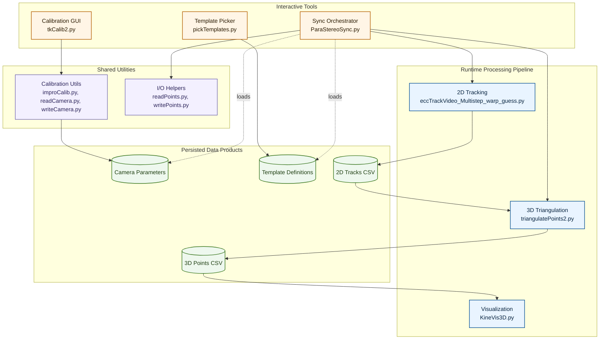
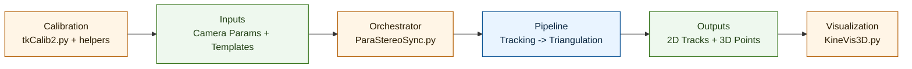

# Software Architecture Plotting

This project can be visualized at two levels:

- Level 1: high-level subsystem architecture (easy to read)
- Level 2: import dependency graph (auto-generated from code)

## 1) High-level architecture (Mermaid)

Use this publication-style layout for docs/paper narrative. It separates
interactive tools, runtime pipeline, and persisted data products.



Suggested figure caption (Software X style):

"Architecture of ParaStereoSync. Calibration and template-selection tools
produce reusable inputs (camera parameters and template definitions), which
are consumed by the synchronization/tracking orchestrator. The runtime pipeline
performs 2D feature tracking, 3D triangulation, and visualization, with CSV
artifacts persisted between stages."

### Compact two-column variant

Use this version when space is limited (for example, two-column manuscript
layouts). It preserves the same control and data semantics with fewer nodes.



Compact caption:

"Compact architecture view of ParaStereoSync showing calibration-derived
inputs, orchestration, tracking/triangulation pipeline, and visualization of
persisted 2D/3D outputs."

## 2) Auto-generated dependency graphs (pydeps)

Generated files in this repository:

- docs1111/architecture/architecture_main.dot
- docs1111/architecture/architecture_calibration.dot

These DOT files were generated from:

- ParaStereoSync.py
- tkCalib2.py

### Re-generate DOT files

From repository root:

```powershell
C:/Users/mearg/.conda/envs/stereosync/python.exe -m pydeps ParaStereoSync.py -x numpy cv2 scipy tkinter multiprocessing concurrent --max-bacon 2 --cluster --show-dot --dot-output docs1111/architecture/architecture_main.dot --no-output
C:/Users/mearg/.conda/envs/stereosync/python.exe -m pydeps tkCalib2.py -x numpy cv2 tkinter matplotlib --max-bacon 2 --cluster --show-dot --dot-output docs1111/architecture/architecture_calibration.dot --no-output
```

### Render DOT to SVG (optional)

If Graphviz is installed and dot is on PATH:

```powershell
dot -Tsvg docs1111/architecture/architecture_main.dot -o docs1111/architecture/architecture_main.svg
dot -Tsvg docs1111/architecture/architecture_calibration.dot -o docs1111/architecture/architecture_calibration.svg
```

## 3) Suggested plotting workflow for this codebase

1. Keep the Mermaid diagram for the paper/manuscript (readability).
2. Keep DOT/SVG import graphs in docs1111/architecture/ for technical appendix.
3. Update both when adding/removing major modules.
